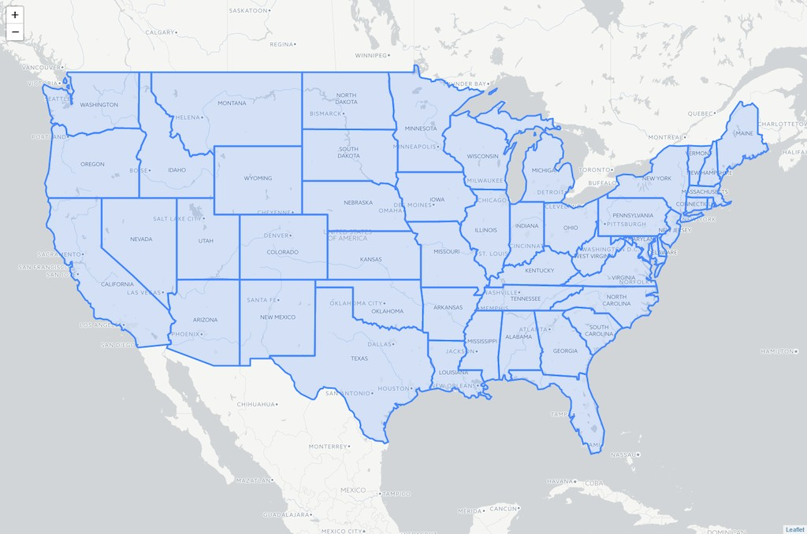
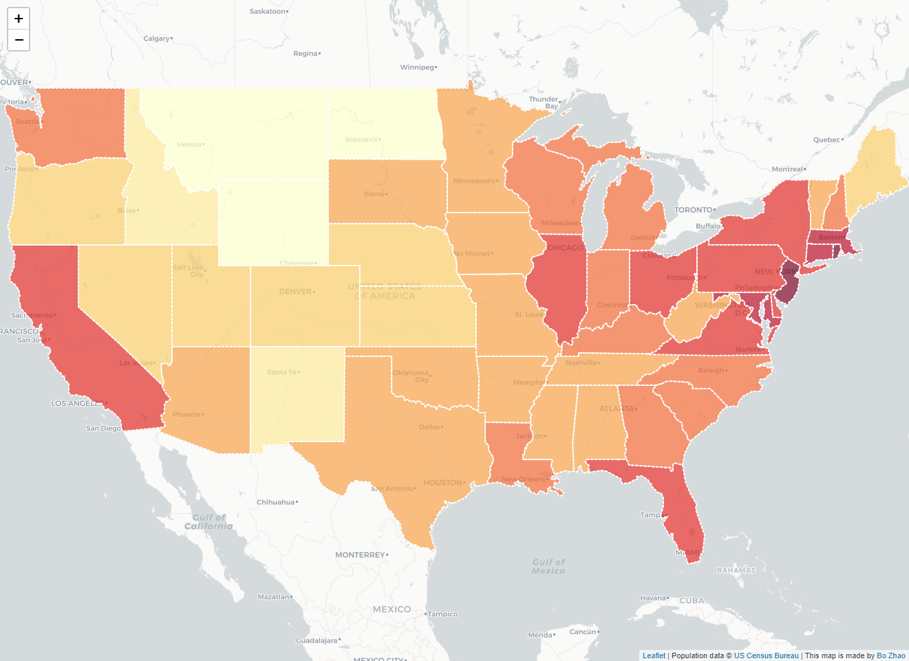
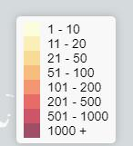

# Map Client III: Web Map Interaction

> Winter 2019 | Geography 371 | Web Mapping
>
> **Instructor:** Bo Zhao | **Location:** WLKN 210 | **Time:** MWF 0800 - 0850

**Learning Objectives**

- Understand the basic concept of Choropleth map;
- Grasp the method to color thematic layers;
- Add more map interactions; and
- Customize map controls.

This lecture creates a colorful interactive [choropleth map](http://en.wikipedia.org/wiki/Choropleth_map) of US States Population Density with the help of [GeoJSON](http://leafletjs.com/examples/geojson/) and some custom controls.

> **Note:** This lecture is modified from the leaflet tutorial at [here](http://leafletjs.com/examples/choropleth/). The look of the web map is similar but the source codes was changed a lot.  We built this application on Jquery and Chroma.js. When you walk through this handout, I would encourage you refer to the tutorial on left. Okay, let us get started!


> **Note:**  A choropleth map is a thematic map in which areas are shaded or patterned in proportion to the measurement of the statistical variable being displayed on the map, such as population density or per-capita income. The choropleth map provides an easy way to visualize how a measurement varies across a geographic area or it shows the level of variability within a region.

##  1. Data source

We’ll be creating a visualization of population density per US state. As the amount of data (state shapes and the density value for each state) is not very big, the most convenient and simple way to store and then display it is [GeoJSON](http://leafletjs.com/examples/geojson/).

Each feature of our GeoJSON data ([us-states.js](assets/us-states.js)) will look like this:


```js
{
  "type": "Feature",
  "properties": {
    "name": "Oregon",
    "density": 40.33
  },
  "geometry": ...
    ...
}
```

The GeoJSON with state shapes is from [Mike Bostock](http://bost.ocks.org/mike) of [D3](http://d3js.org/), extended with density values from [US Census Bureau (2011)](http://www.census.gov/) and assigned to states data JS variable.

## 2. empty html page and prerequisite libraries

We will creat an empty html page and the prerequisite libraries. Other than the `leaflet` fundamental libraries, we will use `chroma.js` to colorize the geographic feature, `jQuery` to manipulate html elements, and leaflet.ajax to load geojson data. So, we will add these three libraries in the `head` elements. As the code snippet showing below.

```html
<head>
    <title>Map Client III: Web Map Interaction</title>
    <meta charset="utf-8"/>
    <meta name="viewport" content="width=device-width, initial-scale=1.0">
    <link rel="stylesheet" href="https://unpkg.com/leaflet@1.4.0/dist/leaflet.css"/>
    <style>
        ...
    </style>
    <script src="https://unpkg.com/leaflet@1.4.0/dist/leaflet.js"></script>
    <script src="https://cdnjs.cloudflare.com/ajax/libs/leaflet-ajax/2.1.0/leaflet.ajax.min.js"></script>
    <script src="https://ajax.googleapis.com/ajax/libs/jquery/3.1.0/jquery.min.js"></script>
    <script src="https://cdnjs.cloudflare.com/ajax/libs/chroma-js/1.3.4/chroma.min.js"></script>
</head>
<body>
    <script>
        //Here goes the javascript code.
    </script>
</body>
</html>
```


##  2. Map object and the base layer

Let’s display our states data on a map with a CartoDB style for nice grayscale tiles that look perfect as a background for visualizations.
above all, create the div element holding the map element.
```html
<div id='map'></div>
```
and then, create the javascript object of the map, and anchor it to the div element.
```js
// 1. create the map object and the base layer.
var map = L.map('map').setView([37.8, -96], 5);
L.tileLayer('http://{s}.basemaps.cartocdn.com/light_all/{z}/{x}/{y}.png').addTo(map);
```

Add add the style class for map, for the goal of expanding the map to full screen.

```css
/*full screen the map*/
html { height:100%;}
body {
    height:100%;
    padding: 0;
    margin: 0;
}
#map {
    width: 100%;
    height: 100%;
}
```



##  3. Adding colors

Now we need to color the states according to their population density. Regarding using color on web environment, please refer to [a tutorial on color at W3Schools]( http://www.w3schools.com/colors/default.asp). the Choosing nice colors for a map can be tricky, but there’s a great tool that can help with it — [ColorBrewer](http://colorbrewer2.org/). Also,

```js
// 2. Create the chorepleth map with interactive functions.
// determine the number of classes and their respective break values.
var grades = [0, 10, 20, 50, 100, 200, 500, 1000];

// determine the color ramp. The number of colors is determined by the number of classes.
// try different interpolation method lch, lab, hsl
// var colors = chroma.scale(['yellow', 'navy']).mode('hsl').colors(grades.length);
var colors = chroma.scale('YlOrRd').colors(grades.length);

// get the color based on the class which the input value falls in.
function getColor(d) {
    for (var i = 0; i < grades.length - 1; i++) {
        if ( d > grades[i] && d < grades[i+1] ) return colors[i];
    }
    if (d > grades[grades.length - 1]) return colors[grades.length];
}
```

Next we define a styling function for our GeoJSON layer so that its fillColor depends onfeature.properties.density property, also adjusting the appearance a bit and adding a nice touch with dashed stroke.

```js
// determine the style class based on the input feature
function style(feature) {
    return {
        weight: 2,
        opacity: 1,
        color: 'white',
        dashArray: '3',
        fillOpacity: 0.7,
        fillColor: getColor(feature.properties.density)
    };
}

geojson = L.geoJson.ajax("assets/us-states.geojson", {
    style: style
}).addTo(map);
```

Looks much better now!



## 4. Adding Interaction

Now let’s make the states highlighted visually in some way when they are hovered with a mouse. First we’ll define an event listener for layer mouseover event:

```js
// 3.2.1 highlight a feature when the mouse hovers on it.
function highlightFeature(e) {
    // e indicates the current event
    var layer = e.target; //the target capture the object which the event associates with
    layer.setStyle({
        weight: 8,
        opacity: 0.8,
        color: '#e3e3e3',
        fillColor: '#1ce3d7',
        fillOpacity: 0.5
    });
    // bring the layer to the front.
    layer.bringToFront();
    // select the update class, and update the contet with the input value.
    $(".update").html('<b>' + layer.feature.properties.name + '</b>   ' + layer.feature.properties.density + ' people / mi<sup>2</sup>');
}
```

Here we get access to the layer that was hovered through `e.target`, set a thick grey border on the layer as our highlight effect, also bringing it to the front so that the border doesn't clash with nearby states (but not for IE, Opera or Edge, since they have problems doing bringToFront on mouseover).

Next we’ll define what happens on mouseout:

```js
// 3.2.3 reset the hightlighted feature when the mouse is out of its region.
function resetHighlight(e) {
    geojson.resetStyle(e.target);
    $(".update").html("Hover over a state");
}
```

The handy `geojson.resetStyle` method will reset the layer style to its default state (defined by our style function). For this to work, make sure our GeoJSON layer is accessible through the geojson variable by defining it before our listeners and assigning the layer to it later:

```js
var geojson;
// ... our listeners
geojson = L.geoJson.ajax(...);
```

As an additional touch, let’s define a click listener that zooms to the state:

```js
// 3.2.2 zoom to the highlighted feature when the mouse is clicking onto it.
function zoomToFeature(e) {
    map.fitBounds(e.target.getBounds());
}
```

Now we’ll use the onEachFeature option to add the listeners on our state layers:

```js
// 3.3 add these event the layer obejct.
function onEachFeature(feature, layer) {
    layer.on({
        mouseover: highlightFeature,
        click: zoomToFeature,
        mouseout: resetHighlight
    });
}

// 3.4 assign the geojson data path, style option and onEachFeature option. And then Add the geojson layer to the map.
geojson = L.geoJson.ajax("assets/us-states.geojson", {
    style: style,
    onEachFeature: onEachFeature
}).addTo(map);
```
This makes the states highlight nicely on hover and gives us the ability to add other interactions inside our listeners.

## 5. Custom Info Control

We could use the usual popups on click to show information about different states, but we’ll choose a different route — showing it on state hover inside a custom control.


Here’s the code for our control:

```html
<div class='info'><h1>US Population Density</h1><div class='update'>Hover over a state</div></div>
```

We need to update the control when the user hovers over a state, so we’ll also modify our listeners as follows:

```js
function highlightFeature(e) {
    ...
    $(".update").html('<b>' + layer.feature.properties.name + '</b>   ' + layer.feature.properties.density + ' people / mi<sup>2</sup>');
}

function resetHighlight(e) {
    ...
    $(".update").html("Hover over a state");
}
```
The control also needs some CSS styles to look nice:

```css
.info {
    z-index: 1000;
    position: absolute;
    right: 20px;
    top: 20px;
    padding: 6px 8px;
    font: 14px Arial, Helvetica, sans-serif;
    text-align: right;
    background: white;
    background: rgba(255, 255, 255, 0.8);
    box-shadow: 0 0 15px rgba(0, 0, 0, 0.2);
    border-radius: 5px;
}
.info h1 {
    font-size: 16px;
    margin: 0 0 5px;
    color: #777777;
}
```

## 6. Custom Legend Control

Creating a control with a legend is easier, since it is static and doesn’t change on state hover. Html code:



```html
<div class='legend'></div>
```

And the javascript code:
```js
// 4. create the legend
var labels = [];
for (var i = 0; i < grades.length - 1; i++) {
    labels.push('<i style="background:' + colors[i] + '"></i> ' + grades[i] + ' - ' + grades[i + 1]);
}
labels.push('<i style="background:' + colors[grades.length - 1] + '"></i> ' + grades[grades.length - 1] + ' +');
$(".legend").html(labels.join('<br>'));
```

CSS styles for the control (we also reuse the info class defined earlier):

```css
/*legend panel*/
.legend {
    z-index: 1000;
    position: absolute;
    right: 20px;
    bottom: 20px;
    padding: 6px 8px;
    font: 14px Arial, Helvetica, sans-serif;
    background: white;
    background: rgba(255, 255, 255, 0.8);
    box-shadow: 0 0 15px rgba(0, 0, 0, 0.2);
    border-radius: 5px;
}
.legend i {
    width: 18px;
    height: 16px;
    float: left;
    margin-right: 8px;
    opacity: 0.7;
}
```

### 7. Credits.

At last, we add the credits on the data, and information about the author.

```js
// 5. create the credits
map.attributionControl.addAttribution('Population data &copy; <a href="http://census.gov/">US Census Bureau</a> | This map is made by <a href="http://geoviz.ceoas.oregonstate.edu">Bo Zhao</a>');
```


## Reference

[1] Choropleth map https://en.wikipedia.org/wiki/Choropleth_map

[2] Color for styling thematic layers http://colorbrewer2.org/

[3] http://www.w3schools.com/colors/default.asp
