# Map Server IV: Base Map Design using Mapbox

> Fall 2017 | Geography 371 | Geovisualization: Web Mapping
>
> **Instructor:** Bo Zhao | **Location:** WLKN 235 | **Time:** MWF 1200 - 1250


In this lecture, we will help you publish a base map using Mapbox. Mapbox is a large provider of custom [online maps](https://en.wikipedia.org/wiki/Online_maps) for websites such as [Foursquare](https://en.wikipedia.org/wiki/Foursquare), [Pinterest](https://en.wikipedia.org/wiki/Pinterest), [Evernote](https://en.wikipedia.org/wiki/Evernote), the Financial Times, [The Weather Channel](https://en.wikipedia.org/wiki/The_Weather_Channel) and [Uber Technologies](https://en.wikipedia.org/wiki/Uber_Technologies).Since 2010, it has rapidly expanded the niche of custom maps, as a response to the limited choice offered by map providers such as [Google Maps](https://en.wikipedia.org/wiki/Google_Maps) and [OpenStreetMap](https://en.wikipedia.org/wiki/OpenStreetMap). Mapbox is the creator of, or a significant contributor to some open source mapping libraries and applications, including the MBTiles specification, the TileMill cartography IDE, the [Leaflet](https://en.wikipedia.org/wiki/Leaflet_(software)) JavaScript library, and the CartoCSS map styling language and parser.The data are taken both from open data sources, such as [OpenStreetMap](https://en.wikipedia.org/wiki/OpenStreetMap) and [NASA](https://en.wikipedia.org/wiki/NASA), and from proprietary data sources, such as [Digital Globe](https://en.wikipedia.org/wiki/DigitalGlobe).

## 1. Create a base map

To create a base map via Mapbox, you need to walk through a tutorial on [How to Create a Custom Style](https://www.mapbox.com/help/create-a-custom-style/). In this tutorial, you’ll start with a list of colors pulled from the Mapbox logo and apply them to the Mapbox Basic style. In the end, you’ll have created a custom-branded map style that reflects the Mapbox brand at any zoom level and at any place across the world.

If you have other complicated troubles in making maps via MapBox, please check the [Design a Map Section of the Mapbox Tutorial](https://www.mapbox.com/help/#design-a-map).

## 2. Publish your MapBox basemap

Once you’ve finished adding data and styling your base map, the next step is to add it to a web page. To use your base map style in **Leaflet**, you will need the **`style URL`** for your map and an **`Access Token`** associated with your account.

### 2.1 Style URL


A [style URL](https://www.mapbox.com/help/define-style-url/) is how you refer to your map style in other Mapbox tools. Combined with your access token, it allows you to access and use your map with any of the [Mapbox developer tools](https://www.mapbox.com/developers).

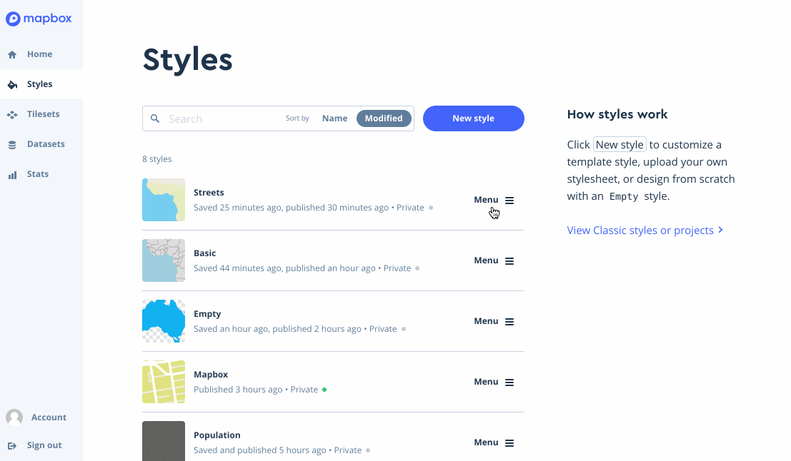

A complete style URL is made up of three components:

```
mapbox://styles/mapbox/streets-v9
```

- `mapbox://styles` – points to Mapbox’s styles API
- `/mapbox` – your Mapbox username
- `/streets-v9` – your style’s unique ID

You can find your map’s style URL in the [Style page of Mapbox Studio](https://www.mapbox.com/studio/styles).

>**Note:** The mapbox://styles notation for Mapbox styles is an alias to the full Styles API URL: https://api.mapbox.com/styles/.

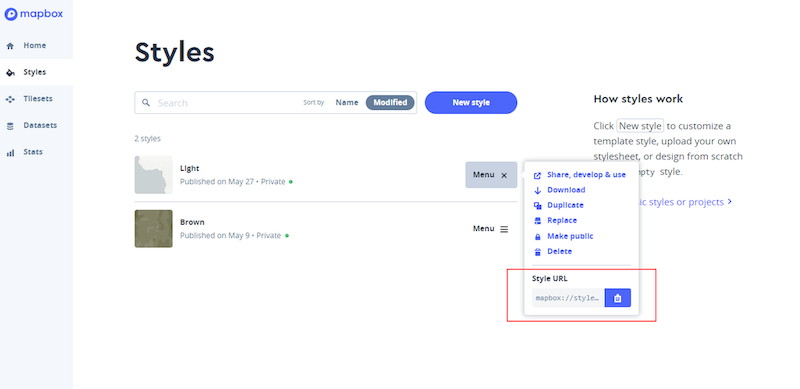

### 2.2 Access Token

Mapbox uses **access tokens** to associate your apps and tool usage with your account. Every account has a default public access token, but you can create new access tokens as well. Your default access token is listed on your Mapbox Studio home page. You can also [manage your access tokens](https://www.mapbox.com/studio/account/tokens/) with Mapbox Studio. 

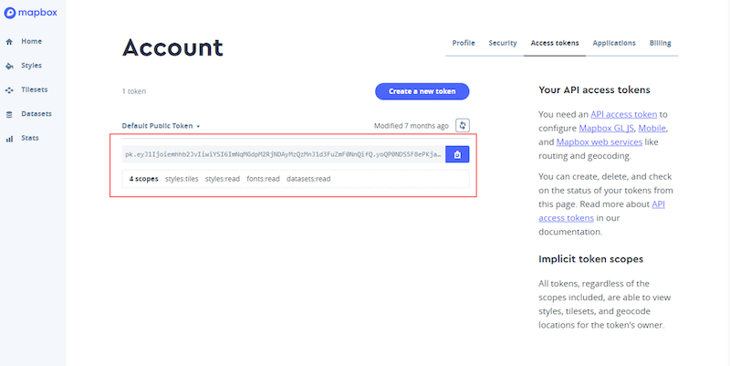


### 2.3 Use the customized basemap in leaflet

In order to show how to use a customized basemap in leaflet, please refer to the source codes of this lecture. Below are the major steps.

1\. By navigating through `Menu` -> `Share, develop & use` item, you will be directed to a new page. In the **develop with this style** section, you can find the access token.

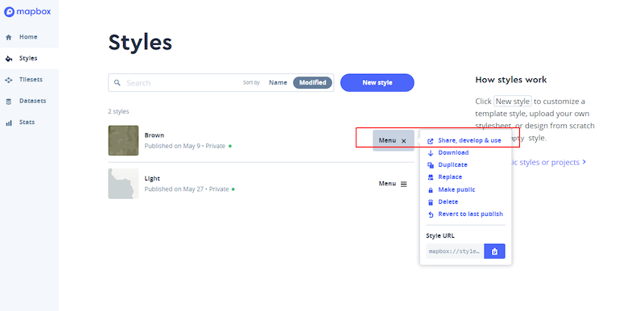

2\. Download the zipped style package by pressing the `download` item.

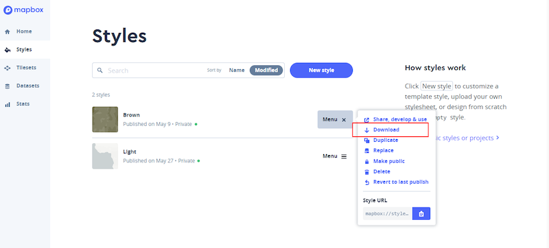

3\. To use the style package, please unzip the file to the `assets` subdirectory. In this subdirectory, you will see a `style.json` file , a `license.txt` file as well as a folder named after `icons`. Make sure the `assets` folder contains all these three itmes. Later. You will need to include the `style.json` to the script of your web map html file.


4\. To use a customized basemap, we should include the following stylesheets and libraries.

```javascript
<!-- Stylesheet -->
<link rel="stylesheet" href="http://cdn.leafletjs.com/leaflet/v1.2.0/leaflet.css"/>
<link href="https://api.tiles.mapbox.com/mapbox-gl-js/v0.40.1/mapbox-gl.css" rel='stylesheet'/>
<!-- Javascript Libraries -->
<script src="http://cdn.leafletjs.com/leaflet/v1.2.0/leaflet.js"></script>
<!-- mapbox gl js -->
<script src="https://api.tiles.mapbox.com/mapbox-gl-js/v0.40.1/mapbox-gl.js"></script>
<!-- leaflet mapbox js -->
<script src="http://rawgit.com/mapbox/mapbox-gl-leaflet/master/leaflet-mapbox-gl.js"></script>
```

5\. Add your MapBox base map.

```javascript
mapbox_token = 'pk.eyJ1Ijoiemhhb2JvIiwiYSI6ImNqMGdpM2RjNDAyMzQzMnJ1d3FuZmF0NnQifQ.yoQP0NDS5F8ePKjaS3EJgQ';

var gl = L.mapboxGL({
    accessToken: mapbox_token,
    style: 'assets/style.json',
    attribution: 'Created By <a href="https://github.com/jakobzhao/">Bo Zhao</a>'
}).addTo(map);
```

To see the demo, please check [here](index.html).

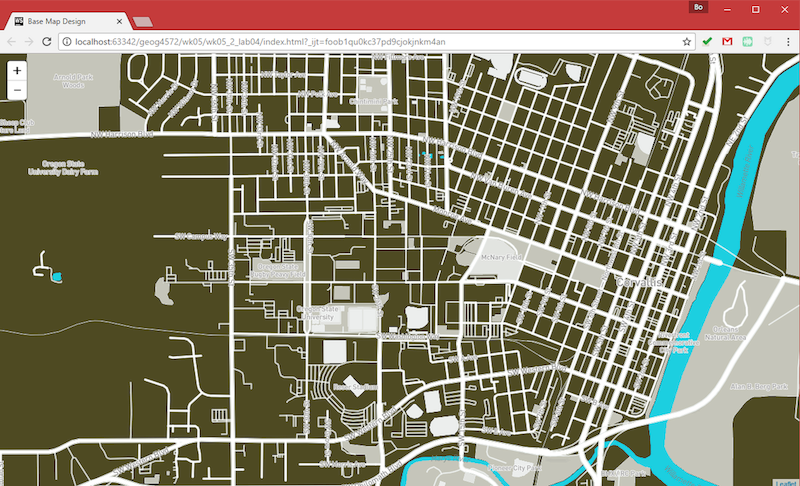

## 3. On the shoulders of giants

You can learn from other popular map design styles, Here are a list of base map you may feel useful. However, **Notably, learning from a map style is NOT exactly copying a map style. We expect to see your own contribution. If you design your map based on other styles, please also metion their contributions as well.**

**OSM Previews**

Please locate and switch to a variety of styles on the right scrollable panel.

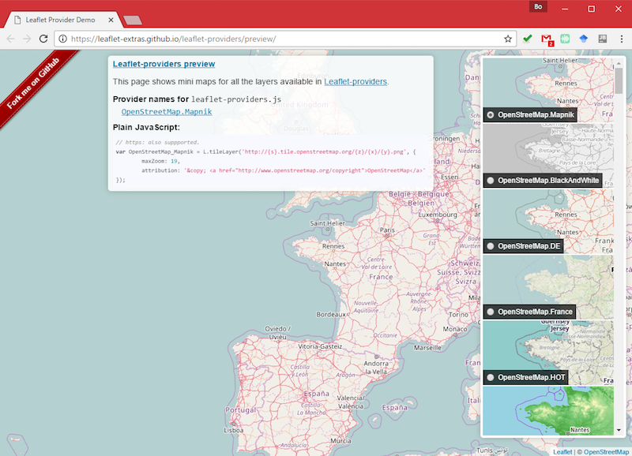

**MapBox Design Gallery**

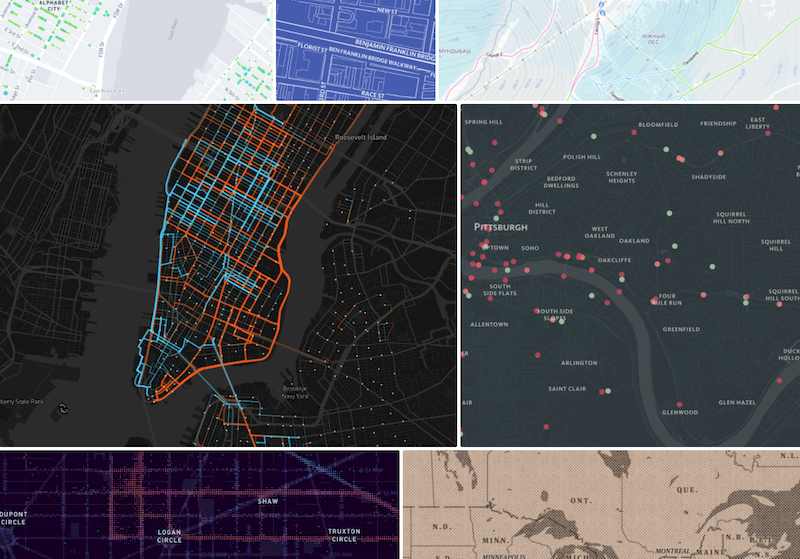

**[MapZen Tangram Play](https://mapzen.com/tangram/play/)**

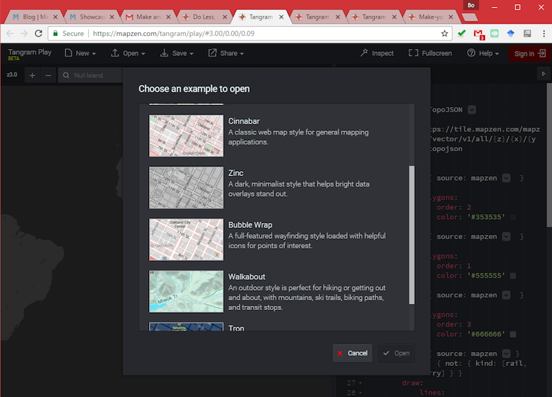

**Google My Maps**

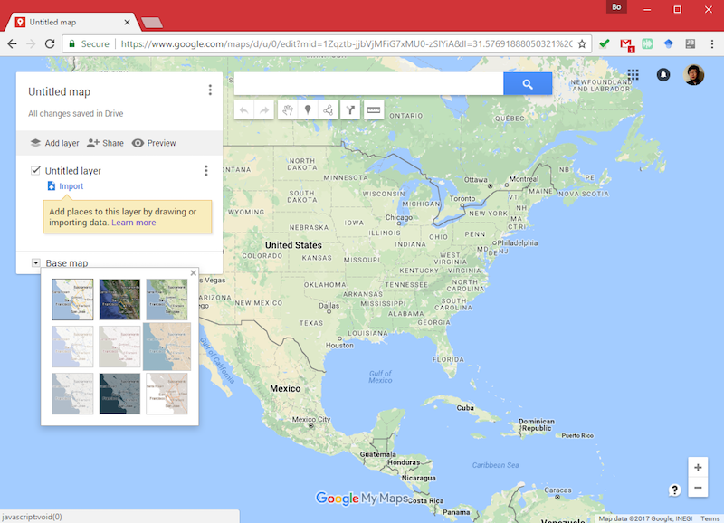


To capture the color of a map, you can follow the following procedure. 

- Create a screenshot of the web map;

- Paste the screenshot to one slide in `Microsoft Powerpoint`;

- Click the `eyedropper` tool under the `Format` tab.

  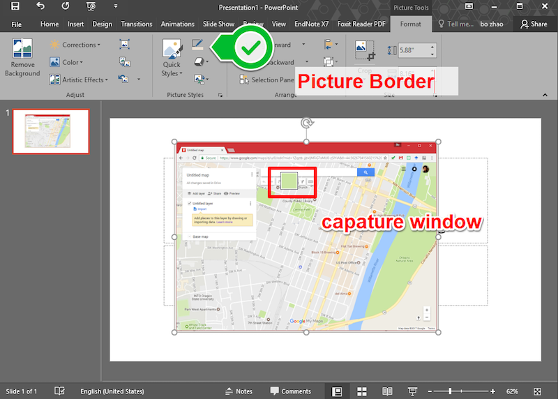

- In `Picture Border` dropdown list, you can get the RGB value of the color by clicking the `more color` item.

  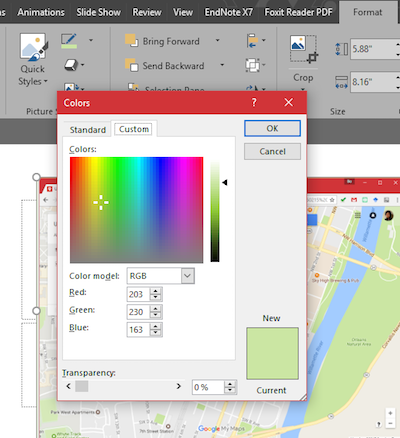


- Get the color value from a RGB to Hex color conversion tool at [http://www.rapidtables.com/convert/color/rgb-to-hex.htm](http://www.rapidtables.com/convert/color/rgb-to-hex.htm).

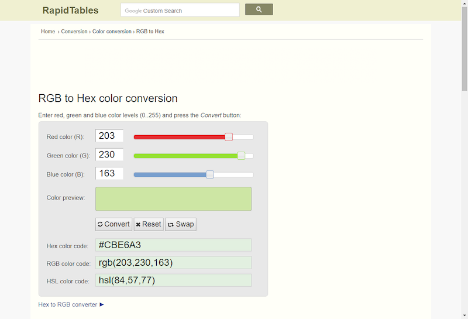
